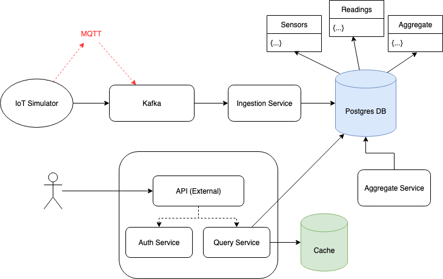

# IoT Telemetry Pipeline

A minimal end-to-end pipeline for ingesting raw IoT sensor readings, publishing them to Kafka, and aggregating them into useful metrics. Designed for quick local spins with Docker Compose and simple Spring Boot services.

## Overview
For detailed design decisions and scalability notes, see [architecture.md](./_docs/architecture.md).



* ### Components

  * ### Tech Stack

    | Component          | Version                         | Purpose                                |
    |--------------------|---------------------------------|----------------------------------------|
    | Java (Spring Boot) | 21 (Spring Boot 3.x)            | Application services                   |
    | Kafka              | bitnami/kafka:3.7.0             | Message broker                         |
    | Postgres           | postgres:16                     | Raw & aggregate storage                |
    | Caffeine Cache     | (in-process library)            | API cache for hot queries              |
    | Prometheus         | prom/prometheus:v2.53.0         | Metrics collection                     |
    | Grafana            | grafana/grafana:11.2.0          | Dashboards & observability             |
    | Kafdrop            | obsidiandynamics/kafdrop:4.0.0  | Kafka topic inspection UI              |
    | JMX Exporter       | bitnami/jmx-exporter:0.20.0     | JVM/Kafka metrics for Prometheus       |
    | Docker Compose     | v2.x                            | Infra & services orchestrator          |


  * #### Services
    * `sensor-simulator` → emits synthetic readings to Kafka
    * `sensor-ingestion-service` → consumes raw readings; validates/transforms; persists to Postgres
    * `aggregate-service` → scheduled jobs that computes raw readings into aggregated data
    * `api-service` → modular monolith (for prototype, faster iteration)
      * `api` → REST controllers & request/response handling
      * `auth` → provides public token API for authorization
      * `query` → data aggregation & queries

* ### Relevant URLs (Metrics, Observability, API)
  * `Grafana` → http://localhost:3000/dashboards (admin/admin)
  * `Prometheus` → http://localhost:9090/targets
  * `Kafka` → http://localhost:9000
  * `OpenAPI` → http://localhost:8099/itp/api/swagger-ui/index.html

## 🚀 Quickstart
Spin up the full pipeline locally and see it in action:
```bash
  ./quickstart.sh
```

> ⚠️ **Note:** For this prototype, secrets (JWT signing key, DB credentials) are defined in `application.properties` and `docker-compose.yml`.
>
> In production, these would be externalized and encrypted (Vault, KMS, Kubernetes Secrets).

To read **full deployment protocol** and steps, click [here](./_docs/deployment.md), and for insights about stability / testing, read [testing.md](./_docs/testing.md).